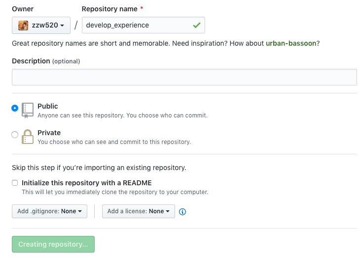

# 本地使用docker搭建gitbook开发环境

[toc]

## 下载gitbook的docker镜像

使用`docker search gitbook`命令可以发现很多gitbook的景象。
这时候我们选取一个比较受欢迎的镜像，执行`docker pull`命令即可。
此处我们使用的镜像是：

```bash
$ docker pull billryan/gitbook
```

### dockerfile解析

暴露4000端口，用于预览gitbook生成的html文档。
默认命令为gitbook --help，我们在运行的时候会使用参数覆盖此命令。

```bash
FROM billryan/gitbook:base
MAINTAINER Rhett <yuanbin2014@gmail.com>

# add non-root user(workaround for docker)
# replace gid and uid with your currently $GID and $UID
#RUN useradd -m -g 100 -u 1000 gitbook
#USER gitbook

# install fonts Noto Sans CJK SC for Simplified Chinese
RUN wget -P /raw_fonts https://noto-website-2.storage.googleapis.com/pkgs/NotoSansCJKsc-hinted.zip && \
    cd /raw_fonts && \
    mkdir /usr/share/fonts/noto && \
    unzip -o NotoSansCJKsc-hinted.zip && \
    mv -t /usr/share/fonts/noto *-DemiLight.otf *-Bold.otf *-Black.otf && \
    rm -r /raw_fonts && \
    fc-cache -f -v

# install gitbook versions
RUN gitbook fetch latest

ENV BOOKDIR /gitbook

VOLUME $BOOKDIR

EXPOSE 4000

WORKDIR $BOOKDIR

CMD ["gitbook", "--help"]
```

### 运行镜像

以下是该镜像在docker hub中给出的用法，其中`-v` 是将本地路径挂在到容器中的gitbook目录下，`$PWD`是需要替换成你要挂载的地址`--rm`是指在容器运行结束之时将容器删除，  `-p`  是端口映射，将本机的4000端口映射到容器中的4000端口。

- `init` 执行完后，你会看到多了两个文件 —— README.md 和 SUMMARY.md。
- `serve` 预览这本书籍，serve包含build命令，执行命令后会对 Markdown 格式的文档进行转换，默认转换为 html 格式，最后提示 “Serving book on [http://localhost:4000](http://localhost:4000/)”。嗯，打开浏览器看一下吧
- `build` 将markdown文件构建成html文件，输出到`_book`文件夹中

```bash
# init
$ docker run --rm -v "$PWD:/gitbook" -p 4000:4000 billryan/gitbook gitbook init
# serve
$ docker run --rm -v "$PWD:/gitbook" -p 4000:4000 billryan/gitbook gitbook serve
# build
$ docker run --rm -v "$PWD:/gitbook" -p 4000:4000 billryan/gitbook gitbook build
```

### 运行报错 TODO

```bash
Error: ENOENT: no such file or directory, stat '/gitbook/docs/gitbook/gitbook-plugin-fontsettings/fontsettings.js'
```

是gitbook的一个bug(Version:3.2.3),解决方法如下，找到对应的文件，
https://blog.csdn.net/weixin_44266650/article/details/89708421

### 修改.zshrc，创建别名

每次这样输入命令都比较麻烦，可以在.zshrc或者.bashrc中定义别名，以简化命令长度,
此外，还可以使用`$(pwd)`来将当前目录挂载到容器里面。使用`source .zshrc`命令来使配置生效。

```bash
alias gitbook='docker run --rm -v $(pwd):/gitbook -p 4000:4000 billryan/gitbook gitbook'
# init
$ gitbook init
# serve
$ gitbook serve
# build
$ gitbook build
# pdf output
$ gitbook pdf .
```

## 同步到github

### 初始化本地git仓库

在当前文件夹执行`git init`，将当前文件夹加入版本管理，并添加.gitignore文件，忽略掉不需要的提交,
.gitignore文件内容如下：

```bash
# .DS_Store(英文全称 Desktop Services Store)是一种由苹果公司的Mac OS X操作系统所创造的隐藏文件，目的在于存贮目录的自定义属性，例如文件们的图标位置或者是背景色的选择。相当于 Windows 下的 desktop.ini
.DS_Store
```


### 创建github仓库并关联

1. 登陆github，创建项目.



2. 本地目录关联远程仓库

```bash
# 添加远程仓库，名称为origin
$ git remote add origin https://github.com/zzw520/develop_experience.git

# 使用get-url参数验证远程仓库是否正确添加
$ git remote get-url origin
https://github.com/zzw520/develop_experience.git

# 首次git push的时候需要--set-upstream
$ git push --set-upstream origin master
```

3. 如果出现git报错fast-forwards

```bash
To https://github.com/zzw520/develop_experience.git
 ! [rejected]        master -> master (non-fast-forward)
error: failed to push some refs to 'https://github.com/zzw520/develop_experience.git'
hint: Updates were rejected because the tip of your current branch is behind
hint: its remote counterpart. Integrate the remote changes (e.g.
hint: 'git pull ...') before pushing again.
hint: See the 'Note about fast-forwards' in 'git push --help' for details.
```

本次提交被远程仓库拒绝了，因为当前分支无法与远程分支对应起来，因为远程仓库的分支有个HEAD指针指向最新的commit，所有本地分支是从这个commit发散开来的。因为我本地新建了README.MD文件，远程又新建了README.MD文件，本地分支的commit不是基于远程commit之上，所以报此错误。此时解决方案有两个：

```bash
# 因为本地和远程仓库没有共同的commit，所以需要--allow-unrelated-histories
$ git pull --allow-unrelated-histories

# 强行覆盖本地代码到远程仓库，这可能会导致远程仓库某些代码丢失
$ git push -f
```

这里我们使用第一种方案，pull下来之后有冲突，解决冲突之后再次git push即可。


## 对外发布你的博客

### 使用github发布

GitHub Pages 是 GitHub 提供的静态网站托管服务。GitHub 上的每个仓库都可以拥有一个 GitHub Pages，对应的 URL 如下：

```bas
https://<username>.github.io/<repository>/
```

GitHub Pages 的静态资源支持下面 3 个来源：

- master分支
- master分支的/docs目录
- gh-pages分支

这里我们使用./docs目录来存放静态网页。

```bash
# 本地构建静态网页
```


### 使用gitbook发布

[gitbook.com](https://www.gitbook.com)是官方提供的笔记托管的在线平台，我们可以选择将github的笔记项目同步到gitbook.com中。这样的好处是本地只需要推送到github中，就会自动更新到gitbook.com中。


